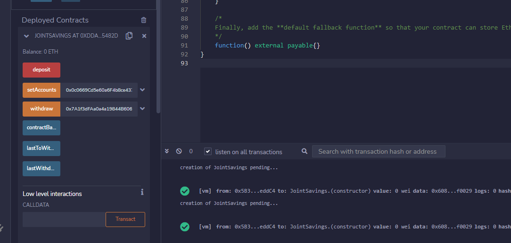
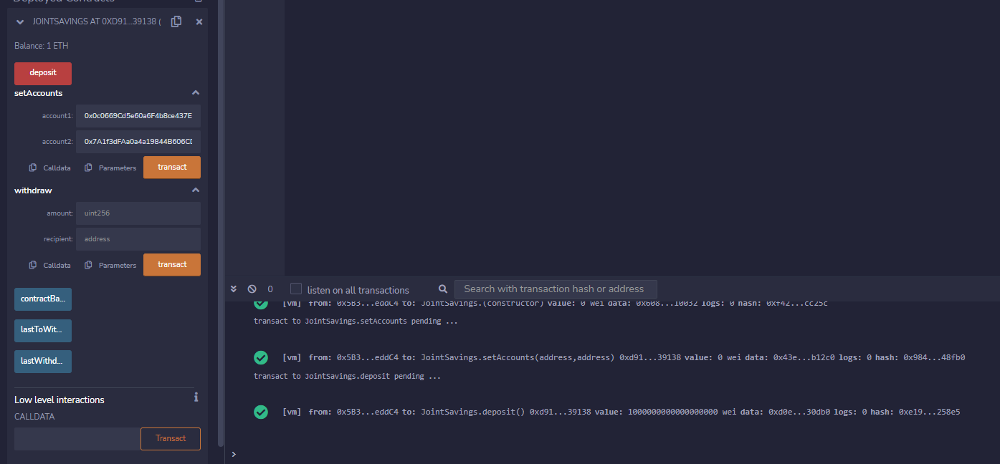
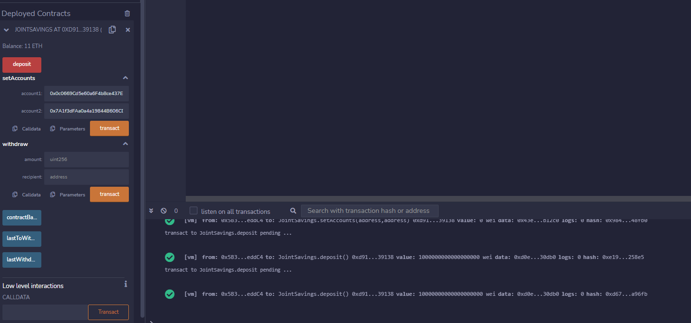
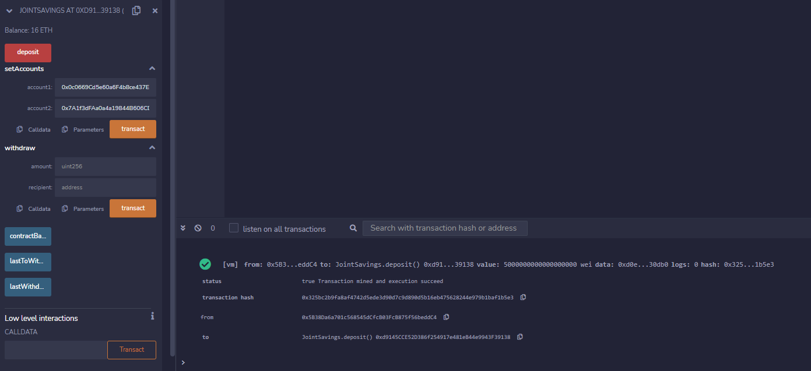
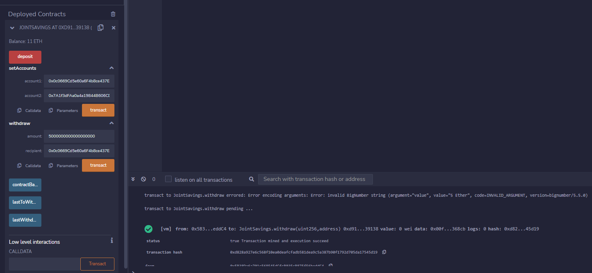
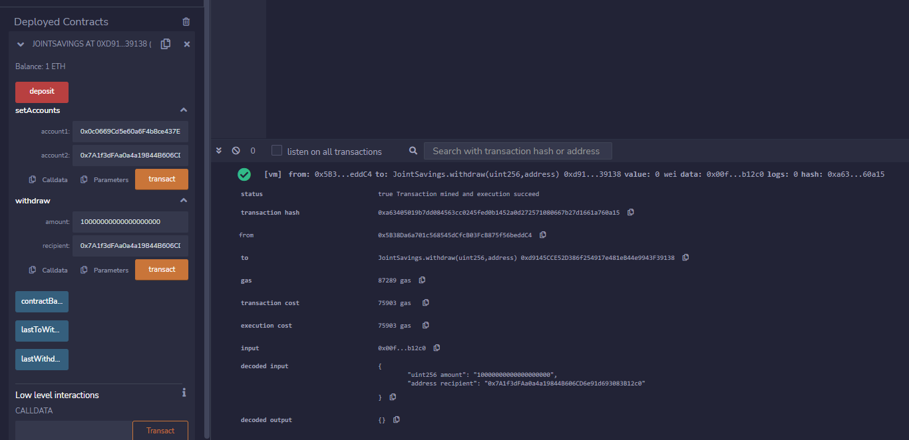
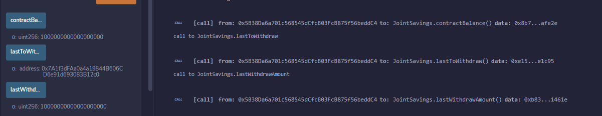

# Module-20-Challenge---Solidity

**Overview**
----
To automate the creation of joint savings accounts, this Solidity smart contract accepts two user addresses. These addresses will be able to control a joint savings account. This smart contract will use ether management functions to implement a financial institution’s requirements for providing the features of the joint savings account. These features will consist of the ability to deposit and withdraw funds from the account.

**Requirements**
----
This project leverages Solidity 0.5.0. The file was opened and creadted using Remix IDE. The remix IDE can be access here: https://remix.ethereum.org

**Visualization**
----

***Screenshot for executing setAccounts function***

***Screenshot for executing deposit function***

Transaction 1: Send 1 ether as wei

Transaction 2: Send 10 ether as wei

Transaction 3: Send 5 ether

***Screenshot for executing withdraw function***

Withdraw 5 ether into account one

Withdraw 10 ether into account two

***Screenshot for executing AccountBalance, lastToWithdraw & lastWithdrawAmount function***

